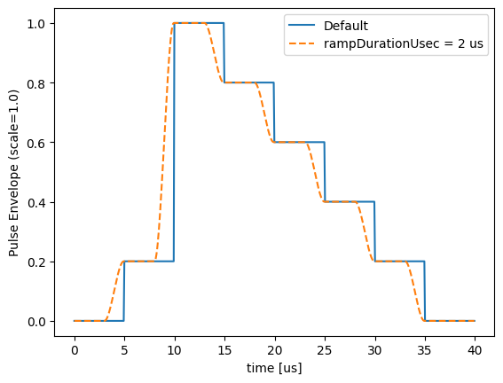
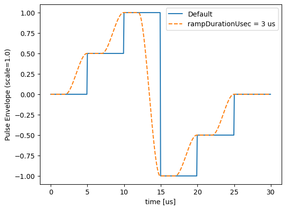

Specifying runtime_options with IonQ jobs
================================================================================

Note that the `runtime_options` parameter is currently (2024-12) only supported in IonQ native gate circuits.

### Qiskit


This is an example Qiskit python script that shows how to attach runtime options to a circuit composed of IonQ native gates:

```
#!/usr/bin/env python

# Requires:
#     python3 (tested on python 3.9 through 3.12)
#     requirements.txt
#
# Setup:
#     0. git clone https://github.com/pdanford/qiskit-ionq.git
#     1. cd qiskit-ionq
#     2. git checkout custom-features
#     3. python -m venv _env_qiskit
#     4. source _env_qiskit/bin/activate
#     5. pip install -e .   # to install this custom qiskit-ionq package
#
# Running:
#     0. cd qiskit-ionq
#     1. source _env_qiskit/bin/activate
#     2. fill in SECRET_API_KEY below
#     3. ./<this_python_script.py>


SECRET_API_KEY="<YOUR_SECRET_KEY>"


# Note: Imports are done in the below example functions instead
#       of here to illustrate the dependencies of each function.


def qc_example_load(qpy_filename = "example_circ.qpy"):
    """
    Load a Qiskit exported .qpy circuit
    """
    from qiskit import QuantumCircuit, qpy
    with open(qpy_filename, 'rb') as fd:
        circuit = qpy.load(fd)[0]
    return circuit


def qc_example_native_gates():
    """
    Create a native gate circuit with a nop gate
    """
    from qiskit import QuantumCircuit
    # import ionq native gates
    from qiskit_ionq import GPIGate, GPI2Gate, MSGate, NOPGate

    # initialize a quantum circuit
    circuit = QuantumCircuit(2, 2)
    # add gates
    circuit.append(MSGate(0, 0), [0, 1])
    circuit.append(GPIGate(0), [0])
    circuit.append(NOPGate(1.2))
    circuit.append(GPI2Gate(1), [1])
    circuit.measure([0, 1], [0, 1])
    return circuit


from qiskit_ionq import IonQProvider, ErrorMitigation

provider = IonQProvider(SECRET_API_KEY)

# >> Run the native circuit on IonQ's qpu hardware <<
qpu = provider.get_backend("ionq_qpu.system-1", gateset="native")

# >> Minimal example of attaching runtime_options
#    Note: in real world use, our_runtime_options_json would typically be loaded from a file due to size.
our_runtime_options_json =  """
                                {
                                "runtime_options":
                                    {
                                        "custom_pulse_shapes":
                                        {
                                            "schema": "am-v4",
                                            "iteration": 0,
                                            "seed_source": "c2-am-v4-2023-07-18-lsrd-iq",
                                            "(0,1)":
                                            {
                                                "tag": "0+1:0",
                                                "durationUsec": 729.6,
                                                "scale": 0.6895113158792494,
                                                "amplitudes":
                                                [
                                                    0.011111111111111111,
                                                    0.022222222222222222
                                                ]
                                            }
                                        }
                                    }
                                }
                            """

job = qpu.run(qc_example_native_gates(),
             shots=100,
             error_mitigation=ErrorMitigation.NO_DEBIASING,
             runtime_options_json=our_runtime_options_json)

# print the counts and probabilities
# print(job.get_counts())
# print(job.get_probabilities())
```

**Note:** To disable the usage of logical qubits and refer to the physical qubits for the gates, the `error_mitigation=ErrorMitigation.NO_DEBIASING` option must be used in the above `run` parameters. For more, see https://docs.ionq.com/sdks/qiskit/error-mitigation-qiskit#specifying-the-debiasing-settings

#### **`custom_pulse_shapes`** payload details

The `custom_pulse_shapes` is a payload with the following schema [JSON Schema](https://json-schema.org) :
```json

{
    "type": "object",
    "properties": {
        "schema": {
            "type": "string",
            "description": "The schema version of the custom pulse shapes payload. Currently, only 'am-v4' is supported."
        },
        "iteration": {
            "type": "integer",
            "description": "An integer representing the iteration of the custom pulse shapes. This can be used to track iterations on the pulse shapes or `scale` calibration."
        },
        "seed_source": {
            "type": "string",
            "description": "A string identifying the source or origin of the pulse shape data. Non-functional. For traceability purposes."
        },
        "additionalProperties": {
            "type": "object",
            "patternProperties": {
                "^\\(\\d+,\\d+\\)$": {
                    "type": "object",
                    "description": "The key specifies a pair of qubits, e.g. '(0,1)', '(3,21)' etc. The object specifies pulse shape details used for 2Q gates on that pair. Multiple pairs allowed.",
                    "properties": {
                        "amplitudes": {
                            "type": "array",
                            "items": {
                                "type": "number"
                            },
                            "description": "An array of amplitudes that define the pulse envelope, in arbitrary units. Values should typically be >= 0 but can go negative to represent multiplication by pi phase. Each value is held for time durationUsec / len(amplitudes)."
                        },
                        "durationUsec": {
                            "type": "number",
                            "description": "The total duration of the pulse in microseconds."
                        },
                        "rampDurationUsec": {
                            "type": "number",
                            "description": "(Optional) perform a cubic spline ramp between each amplitude. This is a low-pass filter that preserves pulse area. Must be <= durationUsec / len(amplitudes). Default = 0 (no ramp)."
                        },
                        "scale": {
                            "type": "number",
                            "minimum": 0.0,
                            "maximum": 1.0,
                            "description": "A scaling factor from 0.0 to 1.0 for the pulse amplitudes. This value needs to be calibrated to achieve the intended MS gate angle."
                        },
                        "detuningShift": {
                            "type": "number",
                            "description": "(MHz, Optional) common (carrier) frequency shift. Shifts sidebands in the same direction. Default = 0"
                        },
                        "nearestModesIdx": {
                            "type": "array",
                            "minItems": 2,
                            "maxItems": 2,
                            "prefixItems": [
                                { "type": "integer" },
                                { "type": "integer" }
                            ],
                            "description": "The indices of lower and upper modes in modeFreqHz",
                        },
                        "relDet": {
                            "type": "array",
                            "minItems": 2,
                            "maxItems": 2,
                            "prefixItems": [
                                { "type": "number" },
                                { "type": "number" }
                            ],
                            "description": "Sets gate detuning by weighted sum of the nearest two motional modes. This field sets the weights. `mu = (relDet[0]*lower + relDet[1]*upper) / sum(relDet)`. Gate sidebands will be at frequencies `carrier + shift - mu`, and `carrier + shift + mu`, where `shift = detuningShift` and `carrier` is set by the system."
                        }
                    },
                    "required": [
                        "amplitudes",
                        "durationUsec",
                        "scale",
                        "nearestModesIdx",
                        "relDet"
                    ]
                }
            }
        }
    },
    "required": [
        "schema",
        "iteration",
        "seed_source",
    ]
}
```


#### Example 
```json
"custom_pulse_shapes": {
    "schema": "am-v4",
    "iteration": 0,
    "seed_source": "reference-file.json",
    "(0,2)": {
        "amplitudes": [0,1,5,4,3,2,1,0],
        "durationUsec": 40.0,
        "scale": 1.0,
        "rampDuration": 2.0,
        "nearestModesIdx": [4,5],
        "relDet": [1,0]
    },
    "(2,5)": {
        "amplitudes": [0,1,2,-2,-1,0],
        "durationUsec": 30.0,
        "scale": 1.0,
        "rampDuration": 3.0,
        "nearestModesIdx": [4,5],
        "relDet": [1,0]
    }
}

```
Pair (0,2)



Pair (2,5)

